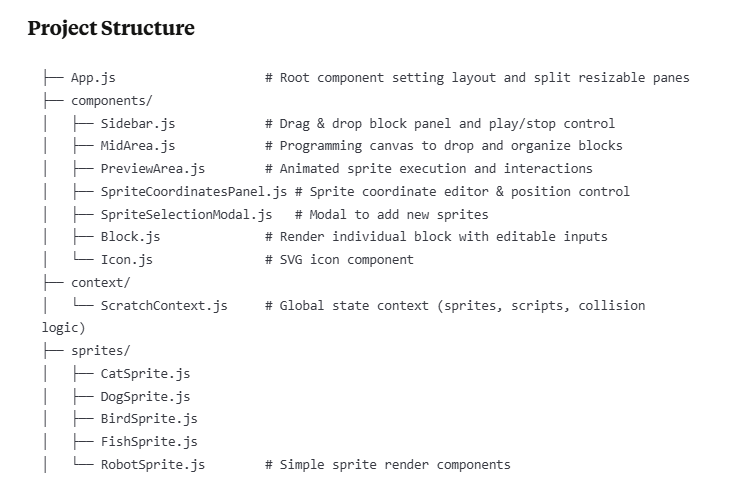

# 🧱 Scratch Visual Coding Playground

A web-based **drag-and-drop visual programming app** inspired by Scratch. Build logic for animated sprites using motion, looks, and control blocks. Designed for fun, learning, and experimentation with basic programming concepts.

---

## ✨ Features

- 🎯 **Drag-and-Drop Code Blocks**: Create logic using motion, looks, and control blocks.
- 🔃 **Drag-and-Drop Reordering**: Change the order of scripts within sprites by dragging and dropping blocks.
- 🧍 **Sprite Programming**: Program multiple animated characters with custom scripts.
- 🧪 **Live Animation Preview**: Instantly see the outcome of your logic in action.
- 💥 **Collision Detection**: Sprites swap scripts when they collide.
- 🛠️ **Editable Positioning**: Modify sprite X/Y coordinates via an interactive panel.
- 🔁 **Loop Support**: Control blocks like repeat are supported.
- 🎮 **Play / Stop Control**: Execute or pause all sprites with a single button.
- ✅ **Reset Button**: Resets all sprite positions and clears their scripts with one click.

---

## 🧩 Tech Stack

| Technology | Description |
|------------|-------------|
| **React** | UI Framework |
| **Tailwind CSS** | Styling |
| **React Context API** | Global state management |
| **UUID** | Unique identifiers for blocks and sprites |
| **SVG Icons** | Interactive visuals |
| **Custom DnD** | Custom drag-and-drop system |

---

## 📸 Screenshots

---

## 📁 Project Structure

---

## 🧠 Smart Behaviors

### 🧱 Block Types
- **Motion**: `move steps`, `turn`, `go to (x,y)`
- **Looks**: `say`, `think`
- **Control**: `repeat`

### 🔃 Script Reordering
- Blocks can be dragged and dropped to:
  - Reorder within the same sprite
  - Move across different sprites
- Provides a smooth and intuitive programming experience

### 💥 Collision Detection
- Sprites detect proximity (<50px)
- Trigger `say` messages (`Collision!`, `Ouch!`)
- Swap scripts & restart animations
- Visual glow feedback

### ✅ Reset Button
- Located in the Preview Area
- Resets:
  - Sprite positions
  - Rotations
  - All blocks/scripts
  - Clears collisions and visual states

---

## 🚀 Getting Started

### 📦 Install Dependencies
npm install

### 🏃 Run the App
- npm start
- Visit http://localhost:3000 in your browser.

---

## 📌 Future Roadmap

- 🔐 Save/Load Projects
- 🧩 Custom Block Creation
- 🔊 Sound Support
- 📱 Mobile/Tablet Touch Support
- 🕹️ Undo/Redo
- 📤 Export Project Logic

